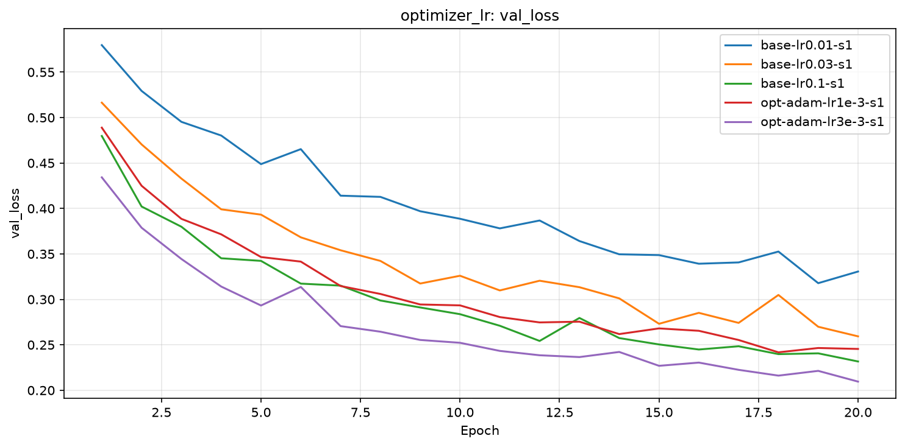
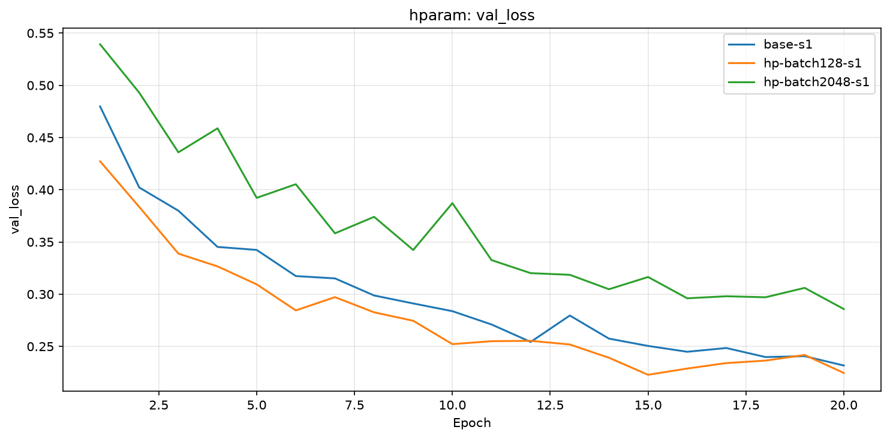
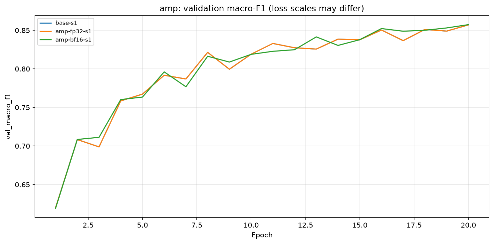
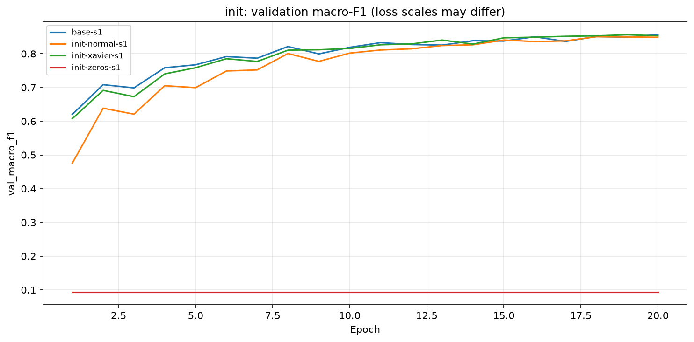
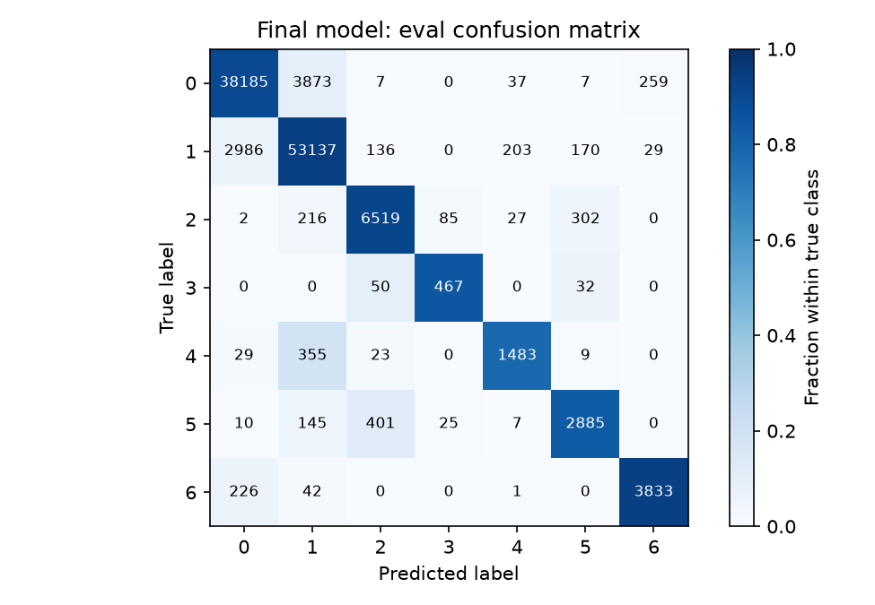

# Báo cáo Lab Day 1 — Bùi Việt Anh — MSSV 2A202602611

## 1. Thiết lập

Windows, CPU, PyTorch `2.14.1+cpu`, Part 3–4 dùng một luồng CPU. Forest CoverType: 464 809 mẫu train gốc, 116 203 eval; tách train/val thành 371 847/92 962 mẫu, phân tầng theo lớp, seed 42. Chuẩn hoá 10 cột số bằng thống kê train; giữ 44 cột nhị phân.

M-base: 54→256→128→7, 47 879 tham số. Baseline `base-s1`: CE (loss phân loại), SGD+momentum 0.9, lr=0.1, batch 512, 20 epoch, He, FP32; dropout và weight decay bằng 0, không clip. Mốc đoán lớp đa số: accuracy val 0.487597 ([Part 2](part2_summary.json)). Chủ đề có JSON đối chiếu: optimizer, batch, init và BF16. Không suy kết luận từ ảnh thiếu JSON.

## 2. Kiểm tra ban đầu và độ nhiễu

| Kiểm tra | Kết quả và nguồn |
|---|---|
| Tham số / đầu ra | 47 879 / (B, 7), notebook Part 1 |
| Loss bước 0 | 2.377572 ở Part 1 seed 42; 2.269062 ở `base-s1` seed 1; ln(7)=1.945910 |
| Học thuộc 20 mẫu | Loss 0.00000725; accuracy 100%, notebook Part 1 |
| Gradient (hướng thay đổi tham số) | Cả 6 tensor có độ lớn khác 0, notebook Part 1 |
| Baseline 3 seed | `base-s1`, `base-s2`, `base-s3` |
| Val accuracy, trung bình ± σ | 0.907977 ± 0.001469 |
| Val macro-F1, trung bình ± σ | 0.846977 ± 0.012753 |

σ là mức dao động giữa các seed; ngưỡng 2σ=0.025507 ước lượng từ ba lần chạy. Loss ban đầu cao hơn ln(7) vì điểm số ngẫu nhiên chưa đều, chưa đủ kết luận model lỗi. Công thức bảng so F1 với **trung bình baseline**; phần so seed 1 dưới đây dùng `base-s1`, nên hai chênh lệch khác nhau: cấu hình chọn so trung bình là +0.031244.

## 3. Kết quả theo chủ đề — chỉ dùng val

### 3.2. Bộ tối ưu và learning rate

Dự đoán trước ở Part 3: Adam điều chỉnh mức cập nhật riêng cho từng trọng số nên có thể giảm loss nhanh hơn; lr=0.003 có thể nhanh hơn 0.001 nhưng dao động hơn.

| exp_id | lr | Epoch val loss thấp nhất | Val macro-F1 |
|---|---:|---:|---:|
| `base-lr0.01-s1` | 0.01 | 19 | 0.765155 |
| `base-lr0.03-s1` | 0.03 | 20 | 0.828942 |
| `base-lr0.1-s1` | 0.1 | 20 | 0.856817 |
| `opt-adam-lr1e-3-s1` | 0.001 | 18 | 0.847013 |
| `opt-adam-lr3e-3-s1` | 0.003 | 20 | 0.878221 |

SGD+momentum chọn lr=0.1, Adam chọn 0.003 trong khoảng đã thử. Adam hơn `base-s1` +0.021404, chưa vượt 2σ=0.025507. SGD lr=0.01 học chậm. Adam 0.001 lại thấp hơn baseline, nên kết luận phụ thuộc lr; chưa chứng minh một optimizer luôn tốt hơn.

### 3.3. Batch size

Dự đoán trước: batch 128 có nhiều bước hơn nên có thể tăng F1, batch 2048 ít bước hơn nên có thể học chậm.

| exp_id | Batch | Tổng bước | Giây/epoch | Val macro-F1 |
|---|---:|---:|---:|---:|
| `hp-batch128-s1` | 128 | 58120 | 3.48 | 0.852537 |
| `base-s1` | 512 | 14540 | 2.04 | 0.856817 |
| `hp-batch2048-s1` | 2048 | 3640 | 1.92 | 0.814233 |

Batch 128 không tăng F1 như dự đoán: lệch `base-s1` -0.004280, dưới 2σ. Batch 2048 lệch -0.042584, vượt ngưỡng tham khảo. Số bước ít hơn có thể giải thích kết quả, nhưng chưa thử giữ cùng số bước. Thời gian baseline thiếu số luồng nên chỉ tham khảo. Giữ mọi lô cuối.

### 3.6. BF16 trên CPU — log bổ sung đã có

Log gốc thiếu dự đoán trước; kỳ vọng theo cơ chế là tính ít bit nhanh hơn khi phần cứng hỗ trợ. `amp-bf16-s1`: 41.25s/epoch, accuracy=0.907070, F1=0.850041; `base-s1` FP32: 2.04s/epoch, accuracy=0.907930, F1=0.856817. BF16 chậm hơn, F1 lệch -0.006776, dưới 2σ. Chi phí đổi kiểu/hỗ trợ CPU là giả thuyết chưa đo riêng. RAM cực đại BF16: 721.3 MB; baseline thiếu số RAM tương ứng. Không có GPU; chưa thử FP16.

.

### 3.7. Khởi tạo — log bổ sung đã có

Không có dự đoán trước trong log gốc; kỳ vọng theo cơ chế là zeros khó học, He phù hợp ReLU (giữ giá trị dương, đưa giá trị âm về 0). Độ phân tán dưới đây đo sau ba lớp Linear, gồm đầu ra, trên 512 mẫu val đầu.

| exp_id | Loss bước 0 | Độ phân tán 3 lớp | Val macro-F1 |
|---|---:|---|---:|
| `init-zeros-s1` | 1.945910 | 0.0000/0.0000/0.0000 | 0.093650 |
| `init-normal-s1` | 1.945996 | 0.0346/0.0038/0.0003 | 0.850497 |
| `init-xavier-s1` | 2.022176 | 0.2780/0.2203/0.1969 | 0.853404 |

He seed 1: độ phân tán 0.6662/0.6464/0.5933 (đo lại ở Part 4), loss/F1 `base-s1`=2.269062/0.856817. Zeros có gradient lớp ẩn bằng 0; chỉ bias đầu ra học, accuracy=0.487597, bằng mốc đa số. Normal làm tín hiệu ban đầu nhỏ nhưng vẫn học được; loss gần ln(7) chưa chứng minh khởi tạo tốt. Normal/Xavier lệch He dưới 2σ; zeros giảm vượt 2σ, mới thử một seed.

.

## 4. Đánh giá cuối trên eval

Log cũ không lưu trọng số; Part 4 chạy lại đúng cấu hình, seed và epoch. Số val của lần chạy lại khác log cũ, nên lưu dòng và ảnh riêng, giữ nguyên log gốc. Chưa xác định nguyên nhân chênh lệch; không điều chỉnh cấu hình để khớp số cũ. Các nhận xét Part 3 vẫn dùng log gốc; bảng eval bên dưới dùng đúng lần tạo CSV.

Cấu hình: **Adam, lr=0.003, batch=512, 20 epoch, seed 1**, chọn trọng số epoch **20** có val loss thấp nhất; các thành phần khác như baseline. Quyết định gốc nằm trong [part3_selection.json](part3_selection.json), trước khi dùng eval. Cấu hình cuối khác baseline.

| Cấu hình / exp_id | Seed | Val macro-F1 | Eval macro-F1 | Eval accuracy |
|---|---:|---:|---:|---:|
| Baseline `base-s1-eval-replay` | 1 | 0.856984 | 0.859116 | 0.905476 |
| Cuối `opt-adam-lr3e-3-s1` | 1 | 0.878221 | 0.880612 | 0.916577 |

Nguồn eval: [baseline](eval_result_baseline.json), [cấu hình cuối](eval_result.json), đều do `scripts/evaluate.py` tạo, n_eval=116203. Eval F1 đổi +0.021496; chưa vượt ngưỡng val 2σ=0.025507, nhưng **chưa đo nhiễu eval** vì chỉ chấm seed 1. Không thay tham số theo kết quả này. F1 eval–val của cấu hình cuối lệch +0.002391.

### 4.1. Lỗi theo lớp

Precision là tỷ lệ đúng trong các mẫu được đoán thuộc lớp; recall là tỷ lệ tìm đúng trong mẫu thật của lớp. Support là số mẫu thật; F1 kết hợp precision và recall.

| Lớp | Support | Precision | Recall | F1 |
|---|---:|---:|---:|---:|
| 0 | 42368 | 0.921497 | 0.901270 | 0.911271 |
| 1 | 56661 | 0.919835 | 0.937806 | 0.928733 |
| 2 | 7151 | 0.913537 | 0.911621 | 0.912578 |
| 3 | 549 | 0.809359 | 0.850638 | 0.829485 |
| 4 | 1899 | 0.843572 | 0.780937 | 0.811047 |
| 5 | 3473 | 0.847283 | 0.830694 | 0.838907 |
| 6 | 4102 | 0.930114 | 0.934422 | 0.932263 |

Lớp khó nhất: **4**, F1=0.811047; thường nhầm sang lớp **1** (355/1899 mẫu, 18.69%). Hàng là nhãn thật, cột là dự đoán. Ma trận cho biết số nhầm; đặc trưng giống nhau hoặc ít mẫu học chỉ là giả thuyết, chưa được kiểm tra bằng thí nghiệm riêng. Lớp 3 chỉ có 549 mẫu nhưng F1=0.829485, cao hơn lớp 4; ít mẫu không giải thích được toàn bộ khó khăn. Có thể thử tăng trọng số loss của lớp khó trên train và chọn bằng val; đây là đề xuất chưa thử, không sửa mô hình sau eval.

## 5. Câu hỏi dẫn dắt

- **Câu 1 — optimizer:** Adam 0.003 cao nhất trong lr đã thử; nếu chỉ dùng Adam 0.001 thì thứ hạng đảo (bảng 3.2). Phải chỉnh lr cho mỗi bộ và xét nhiễu.
- **Câu 4 — precision:** BF16 CPU chậm hơn (`amp-bf16-s1`); chưa đo riêng chi phí đổi kiểu hoặc GPU.
- **Câu 5 — khởi tạo:** zeros chặn gradient lớp ẩn. He bù tín hiệu ReLU bỏ đi; Xavier cân bằng tín hiệu vào/ra. Khác biệt quan trọng khi nhiều lớp làm tín hiệu suy giảm; log này chưa chứng minh He vượt Xavier ổn định.
- **Câu 6 — ba kiểm tra đầu:** (1) kiểm tra nhãn 0..6, ghép mẫu–nhãn, chuẩn hoá và đầu ra (B,7), loại lỗi dữ liệu/loss; (2) xem gradient khác 0, hữu hạn và trọng số có đổi sau cập nhật, kiểm tra model thực sự học (`init-zeros-s1` là ví dụ lỗi); (3) thử học thuộc 20 mẫu, tắt dropout và khảo sát vài lr trên train/val, phân biệt lỗi pipeline với tốc độ học sai. Part 1 đạt loss 0.00000725.

## 6. Hạn chế và điều bất ngờ

Batch nhỏ không cải thiện như dự đoán; BF16 CPU chậm. Các chủ đề bổ sung thiếu dự đoán trước được lưu; số seed ít, các batch khác tổng bước và số đo thời gian cũ thiếu thông tin môi trường. Seed 2/3 của cấu hình Adam (`final-check-s2`, `final-check-s3`) chỉ có val, không dùng để chọn seed nộp. Giả thuyết về nguyên nhân nhầm lớp và sai lệch khi chạy lại chưa được kiểm tra. Nếu có thêm thời gian: so batch với cùng số bước, nhiều seed và khảo sát đặc trưng của lớp khó; thực hiện trên train/val.

## 7. Phụ lục

File chính: `code/lab.ipynb`, `code/train.py`, `code/results_table.py`, `predictions_eval.csv`, `eval_result.json`, `experiments.xlsx`, `REPORT.md`, `results/`, `figures/`. Baseline giữ riêng `predictions_eval_baseline.csv`, `eval_result_baseline.json`; [manifest](part4_manifest.json) ghi đúng seed, epoch và exp_id tạo file nộp. JSON lịch sử chỉ chứa cấu hình, lịch sử, tóm tắt; trọng số nằm riêng trong `checkpoints/` (bị gitignore).

Tổng thời gian các epoch trong JSON: khoảng 25.8 phút, không gồm đọc dữ liệu, kiểm tra Part 1 và chấm. Bảng giữ bốn sheet/cột/công thức của mẫu; Excel tính lại trước khi kiểm tra.
